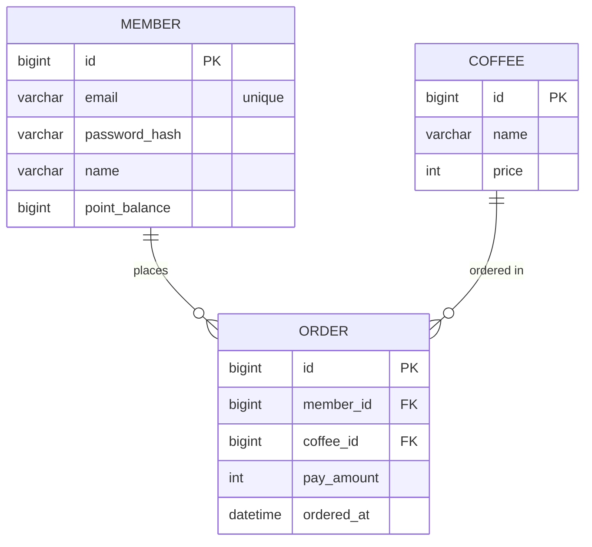

# 커피 주문 서비스

Spring Boot 4.1.0 / Java 17 · MySQL · Redis · Kafka 기반 커피 주문/결제 백엔드.

상세 설계 문서: [docs/erd.md](docs/erd.md) · [docs/api-spec.md](docs/api-spec.md) · [docs/design-policy.md](docs/design-policy.md) · [docs/tech-stack.md](docs/tech-stack.md) · [docs/code-convention.md](docs/code-convention.md)

---

# 0. 문제 해결 전략 수립

## 설계 내용 — ERD

최소 조건 기준 3-엔티티(MEMBER · COFFEE · ORDER). 포인트는 별도 이력 테이블 없이 `MEMBER.point_balance` 컬럼으로 충전/차감한다.



- `MEMBER 1 : N ORDER`, `COFFEE 1 : N ORDER`
- `ORDER.pay_amount`는 주문 시점 가격 스냅샷(이후 가격 변경과 무관하게 매출·주문 금액 보존)
- 컬럼별 상세는 [docs/erd.md](docs/erd.md)

## 설계 내용 — API 명세서

- Base URL: `/api/v1`
- 공통 응답: `{ "message": ..., "data": ... }` (실패 시 `data`는 `null`)

| # | 기능 | Method & Path | 성공 |
|---|------|---------------|------|
| 1 | 회원 가입 | `POST /api/v1/members` | 201 |
| 2 | 커피 메뉴 목록 조회 | `GET /api/v1/coffees` | 200 |
| 3 | 포인트 충전 | `POST /api/v1/members/{memberId}/points` | 200 |
| 4 | 커피 주문/결제 | `POST /api/v1/orders` | 201 |
| 5 | 인기 메뉴 목록 조회 | `GET /api/v1/coffees/popular` | 200 |

### 1. 회원 가입 — `POST /api/v1/members`

**Request**
```json
{ "email": "buyer@example.com", "password": "P@ssw0rd!", "name": "김구매" }
```
**Response `201`**
```json
{ "message": "회원 가입이 완료되었습니다.", "data": { "id": 1, "email": "buyer@example.com", "name": "김구매" } }
```
**실패** — `400` 필수값 누락/형식 오류 · `409` 이메일 중복

### 2. 커피 메뉴 목록 조회 — `GET /api/v1/coffees`

**Response `200`**
```json
{
  "message": "커피 메뉴 조회가 완료되었습니다.",
  "data": [
    { "id": 1, "name": "아메리카노", "price": 4000 },
    { "id": 2, "name": "카페라떼", "price": 4500 }
  ]
}
```
**실패** — 없음(비어 있으면 빈 배열)

### 3. 포인트 충전 — `POST /api/v1/members/{memberId}/points`

**Request**
```json
{ "amount": 10000 }
```
**Response `200`**
```json
{ "message": "포인트 충전이 완료되었습니다.", "data": { "memberId": 1, "pointBalance": 10000 } }
```
**실패** — `400` amount 누락/0 이하 · `404` 존재하지 않는 회원

### 4. 커피 주문/결제 — `POST /api/v1/orders`

**Request**
```json
{ "memberId": 1, "coffeeId": 2 }
```
**Response `201`**
```json
{
  "message": "주문 및 결제가 완료되었습니다.",
  "data": {
    "orderId": 1, "memberId": 1, "coffeeId": 2,
    "payAmount": 4500, "pointBalance": 5500,
    "orderedAt": "2026-07-10T14:00:00"
  }
}
```
**실패** — `400` 필수값 오류 · `404` 회원/메뉴 없음 · `409` 포인트 잔액 부족

> 주문 생성 → 포인트 차감 → 주문 저장은 하나의 트랜잭션. 커밋 이후 `order.completed` 이벤트를 Kafka로 발행하며, 이 이벤트가 데이터 수집 플랫폼 전송과 인기 메뉴 Redis 적재의 공통 소스다. 발행 실패는 결제를 롤백하지 않는다.

### 5. 인기 메뉴 목록 조회 — `GET /api/v1/coffees/popular`

최근 7일(오늘 포함, 캘린더일 기준) 주문 횟수 상위 3개.

**Response `200`**
```json
{
  "message": "인기 메뉴 조회가 완료되었습니다.",
  "data": [
    { "rank": 1, "id": 2, "name": "카페라떼", "price": 4500, "orderCount": 120 },
    { "rank": 2, "id": 1, "name": "아메리카노", "price": 4000, "orderCount": 98 },
    { "rank": 3, "id": 5, "name": "바닐라라떼", "price": 5000, "orderCount": 98 }
  ]
}
```
- 동점(orderCount 동일) 시 메뉴 ID 오름차순
- 3개 미만이면 있는 만큼, 없으면 빈 배열

전체 요청/응답 표는 [docs/api-spec.md](docs/api-spec.md).

## 설계의 의도

- **3-엔티티 최소 구성** — 요구사항을 만족하는 최소 테이블만 둔다. 포인트 이력·주문 상세(OrderItem)·역할/상태는 요구사항에 없어 제외하고 "확장 지점"으로만 남긴다.
- **포인트 잔액 컬럼** — 별도 이력 테이블 없이 `MEMBER.point_balance`로 충전/차감. 정산·추적 요구가 생기면 `POINT_HISTORY` 추가가 확장 지점.
- **결제금액 스냅샷** — `ORDER.pay_amount`에 주문 시점 가격을 박아, 이후 커피 가격이 바뀌어도 과거 주문 금액·매출 집계가 흔들리지 않는다.
- **1주문 = 1메뉴** — 요구사항이 "메뉴 ID(단수) 입력"이므로 주문 상세 테이블 없이 `ORDER`가 메뉴를 직접 참조. 장바구니가 필요해지면 `OrderItem` 분리가 확장 지점.
- **결제 정합성 우선** — 포인트 차감과 주문 저장을 한 트랜잭션으로 묶고, 외부 전송(Kafka)·랭킹 적재(Redis)는 커밋 이후의 후속 작업으로 분리해 결제 경로를 지킨다.

## 선택한 문제해결 전략 및 분석

### 인기 메뉴 집계 — "정확하게" + "조회 부하 없이"

| 전략 | 장점 | 단점 |
|------|------|------|
| DB 실시간 집계(`GROUP BY COUNT`) | 항상 정확, 단순 | 조회마다 기간 스캔·집계 부하 |
| **Redis Sorted Set (선택)** | 조회 O(logN), 랭킹 특화 | 캘린더일 윈도우·정확성 보정 필요 |
| DB 집계 + Redis 캐시 | 정확성·성능 절충 | 캐시 무효화 등 구현량 증가 |

**선택: Redis Sorted Set + Kafka 이벤트 소싱**

- 결제 커밋 후 `order.completed` **1건만** Kafka로 발행한다.
- 이 이벤트를 **인기 메뉴 Consumer**가 소비해 일자별 키에 `ZINCRBY popular:coffee:{yyyyMMdd} 1 {coffeeId}`로 누적한다. → Redis는 서비스가 직접 만지지 않는, **Kafka 이벤트로 만들어지는 materialized view**.
- 조회는 오늘 포함 7개 일자 키를 `ZUNIONSTORE`로 합산 후 `ZREVRANGE 0 2 WITHSCORES`. 일자별 키 TTL(약 8일)로 "최근 7일"이 키 구성만으로 유지된다.
- 동점 시 Redis 기본 정렬은 사전순이라, **애플리케이션에서 (횟수 desc, 메뉴ID asc)로 재정렬**해 규칙을 보장한다.

### 데이터 수집 플랫폼 실시간 전송

- 같은 `order.completed` 토픽을 **데이터 수집 플랫폼 Consumer**가 소비한다. MVP에서는 Mock consumer/테스트로 수신(사용자 식별값·메뉴ID·결제금액)을 검증한다.
- 전송(발행) 실패가 결제를 롤백하지 않는다. (결제 정합성 > 전송 성공)

### 정확성 담보

- **주문 원장(ORDER 테이블)이 정확성의 원천(source of truth)**. Redis 랭킹이 유실돼도 `ORDER.ordered_at`/`coffee_id` 기준 `GROUP BY` 또는 토픽 재소비로 재구축할 수 있다.

## 기술적 선택 이유

| 기술 | 역할 | 선택 이유 |
|------|------|-----------|
| Spring Boot 4.1.0 | REST·비즈니스 로직·트랜잭션 | `@Transactional`로 포인트 차감+주문 저장을 원자화해 이중 결제/잔액 불일치 방지 |
| MySQL | 원장(source of truth) | 결제·정산 정합성을 트랜잭션이 보장하는 RDB에 둔다. 인기 메뉴 재구축의 근거 |
| Kafka | 주문 이벤트 단일 소스 | 데이터 전송과 랭킹 적재를 같은 스트림에서 분기. 수집 플랫폼 장애가 결제에 영향을 주지 않고, Redis 유실 시 재소비로 재구축 가능 |
| Redis | 인기 메뉴 랭킹 서빙 | Sorted Set으로 Top-N 조회 O(logN). 일자별 키+TTL로 슬라이딩 윈도우를 자연스럽게 표현 |

**데이터 흐름 (주문 1건):**

```
POST /api/v1/orders
   → [Service] @Transactional { MySQL: 잔액확인 → 포인트차감 → ORDER insert } 커밋
        → Kafka produce: order.completed
             ├─ 인기메뉴 Consumer     → Redis ZINCRBY popular:coffee:{today}
             └─ 데이터수집 Consumer   → Mock/테스트로 수신 검증
```

기술별 상세는 [docs/tech-stack.md](docs/tech-stack.md), 정책 상세는 [docs/design-policy.md](docs/design-policy.md).
