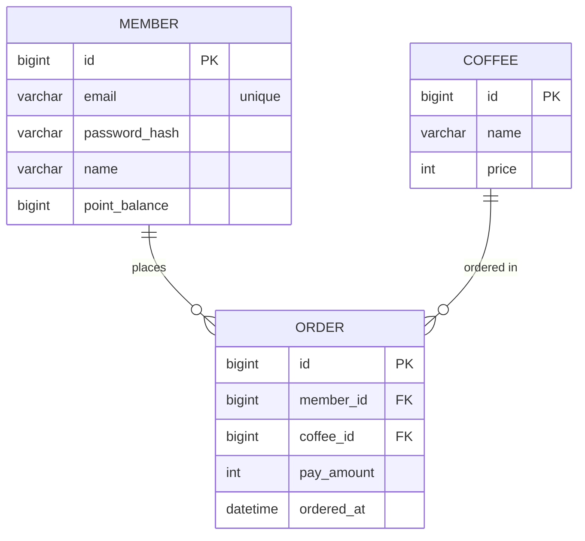

# 커피 주문 서비스 ERD (MVP)

최소 조건 기준 3-엔티티 구성이다. 포인트는 별도 이력 테이블 없이 `MEMBER.point_balance` 컬럼으로 충전/차감한다.

## 다이어그램

## 엔티티

### MEMBER — 회원

| 컬럼 | 타입 | 제약 | 설명 |
|------|------|------|------|
| id | bigint | PK | 회원 식별값 |
| email | varchar | unique, not null | 로그인 이메일 |
| password_hash | varchar | not null | 비밀번호 해시(평문 저장 금지) |
| name | varchar | not null | 회원 이름 |
| point_balance | bigint | not null, default 0 | 보유 포인트 잔액(1원 = 1P) |

### COFFEE — 커피 메뉴

| 컬럼 | 타입 | 제약 | 설명 |
|------|------|------|------|
| id | bigint | PK | 메뉴 식별값 |
| name | varchar | not null | 커피 이름 |
| price | int | not null | 가격(원) |

### ORDER — 주문/결제

| 컬럼 | 타입 | 제약 | 설명 |
|------|------|------|------|
| id | bigint | PK | 주문 식별값 |
| member_id | bigint | FK → MEMBER.id, not null | 주문 회원 |
| coffee_id | bigint | FK → COFFEE.id, not null | 주문 메뉴 |
| pay_amount | int | not null | 결제 금액(주문 시점 가격 스냅샷) |
| ordered_at | datetime | not null | 주문 일시 |

## 관계

- `MEMBER 1 : N ORDER` — 한 회원이 여러 번 주문한다.
- `COFFEE 1 : N ORDER` — 한 메뉴가 여러 주문에 등장한다.

## 설계 메모

- **포인트 이력 없음** — 최소 조건이라 충전/사용 이력을 남기지 않고 잔액 컬럼만 관리한다. 정산·추적이 필요해지면 `POINT_HISTORY` 테이블을 추가한다.
- **pay_amount 스냅샷** — 주문 시점 가격을 `ORDER`에 저장해, 이후 `COFFEE.price`가 바뀌어도 과거 주문 금액이 변하지 않게 한다.
- **주문 트랜잭션** — 주문 생성과 `MEMBER.point_balance` 차감은 하나의 트랜잭션으로 처리한다.
- **role/status 제외** — 판매자/CS/관리자 역할, 회원 상태는 커피 주문 MVP 범위 밖이라 컬럼으로 두지 않는다.
- **인기 메뉴 집계** — 별도 테이블을 두지 않는다. 조회는 Redis Sorted Set(일자별 키 + TTL)을 서빙 계층으로 쓰고, `ORDER.ordered_at`/`coffee_id`가 정확성의 원천이자 재구축 근거다. 상세는 [design-policy.md](design-policy.md).
